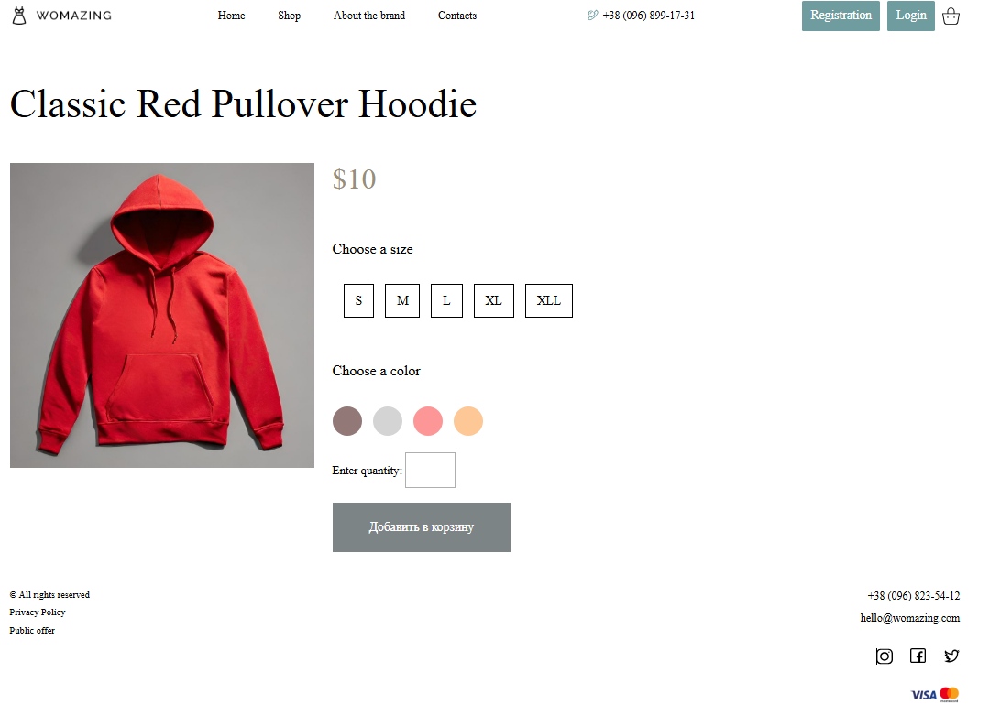
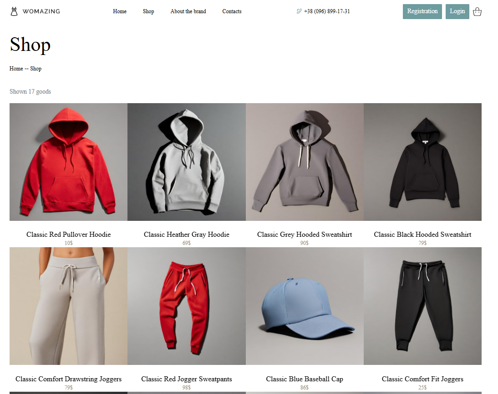
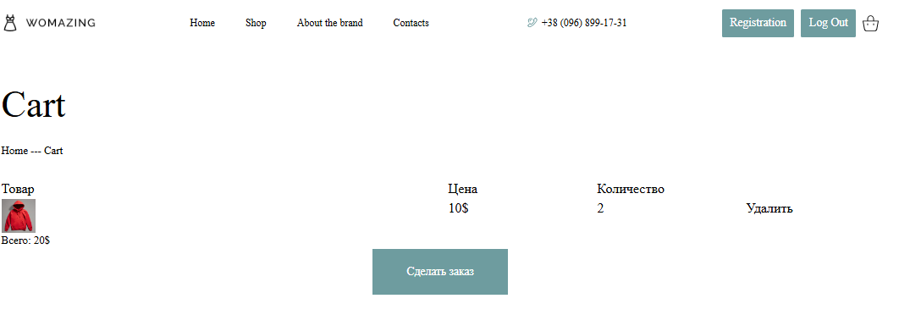

# 🛒 E-Commerce SPA

Це односторінковий застосунок (SPA) для онлайн-магазину, який взаємодіє з бекендом через REST API. Реалізовано авторизацію, перегляд товарів, додавання в корзину, збереження сесії через JWT.

---

## 🚀 Стек технологій

- **Frontend:** React, Redux Toolkit, Bootstrap, React Router, Axios, SASS
- **Auth:** JWT (збереження токену в `localStorage`)
- **State:** Redux + Redux Thunk / RTK Query
- **API:** Platzi Fake Store API - готове апі

---

## 🔑 Основні функції

- 🔐 Реєстрація та логін користувача (JWT токен)
- 🛍️ Перегляд списку товарів (отримання з API)
- 🛒 Кошик з додаванням, видаленням та збереженням товарів
- 📦 Перевірка замовлення
- 💾 Збереження стану сесії через `localStorage`
- ⚠️ Захищені маршрути (перевірка токена при навігації)

---

## 📸 Скріншоти

| Головна                         | Сторінка товара                   | Товари                                 | Кошик                           | 
| ------------------------------- |---------------------------------- |--------------------------------------- | ------------------------------- |
| |   | | |

---

## ⚙️ Як запустити

### 🔧 Клонуй репозиторій:

```bash
git clone https://github.com/BogdanVituk/ecommerce-client.git
cd ecommerce-spa
npm install
```
